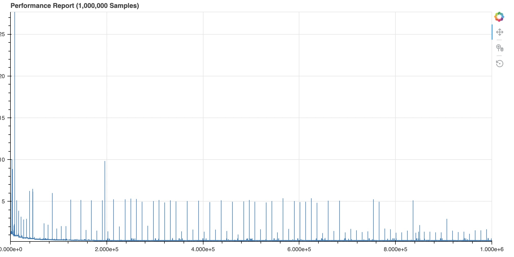

# About
This project aims to perform AES quickly enough so that it could be used for encryption
of CAN data. It is currently achieving encryption / decryption round trip time of around 300ns
on my laptop.

There are hardware operations to perform AES that can achieve even higher performance and also some
mathematical changes I can make, however 300ns is already fast enough that further improvements are no longer necessary.

Python script is also provided to convert journal written in C++ benchmark into a viewable html page that shows round trip times of 1M encryption / decryption rounds.

Since this was benchmarked on MacOS effort has been taken to isolate process on Mac and add hardware level timings to get performance as high as possible. This makes this code only possible to run on MacOS at this stage.

# Performance Improvements
* Inlined Subbox and Galois Table lookups which gave over x2 improvement
* Compiler optimizations gave around x30 improvement
* Process isolation, core pinning and warming up of cache / branch predictor:
    * Reduced tail latency from 30,000ns to around 10,000ns.
    * Tail latency is most likely caused by hardware interrupts which are not possible to
    avoid on mac (at least from what I have seen so far)
* P99 of 416ns
* P99.9 of 485ns

## Start Profile

## Process Isolation

## Cache + Branch Predictor Warmup

# Running
`./aes_main`

# Building
`cmake .. -G Ninja`
`ninja`

# Presets
There are debug, release, sanitizer and profiling presets
i.e. `cmake .. --preset=release`
